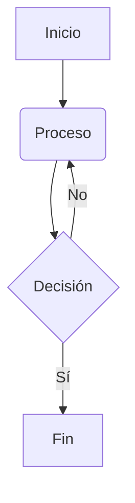

# Sistema de Gestión de Biblioteca

## Integrantes

- Pereyra Joaquín Gabriel.
- Mateo Joaquín Rivero Correa.
- Jorge Ordoñez.
- Aldana Gonzalez.

## Descripción

Este repositorio contiene un Sistema de Gestión de Biblioteca, en el cual se podrá gestionar usuarios, libros y prestamos. Su función principal sería la recomendación de libros, en la que cada usuario dependiendo del contenido que lea se le dará posibles sugerencias para llevar. 

Este proyecto fue programado con el lenguaje de programación Python junto con el uso del paradigma de Programación Orientada a Objetos. Se hizo de esta manera para controlar mejor cada clase y debido a la facilidad de codificar con este lenguaje.

## Instrucciones de Uso
[EN CONSTRUCCIÓN]

## Diagrama de Clases

