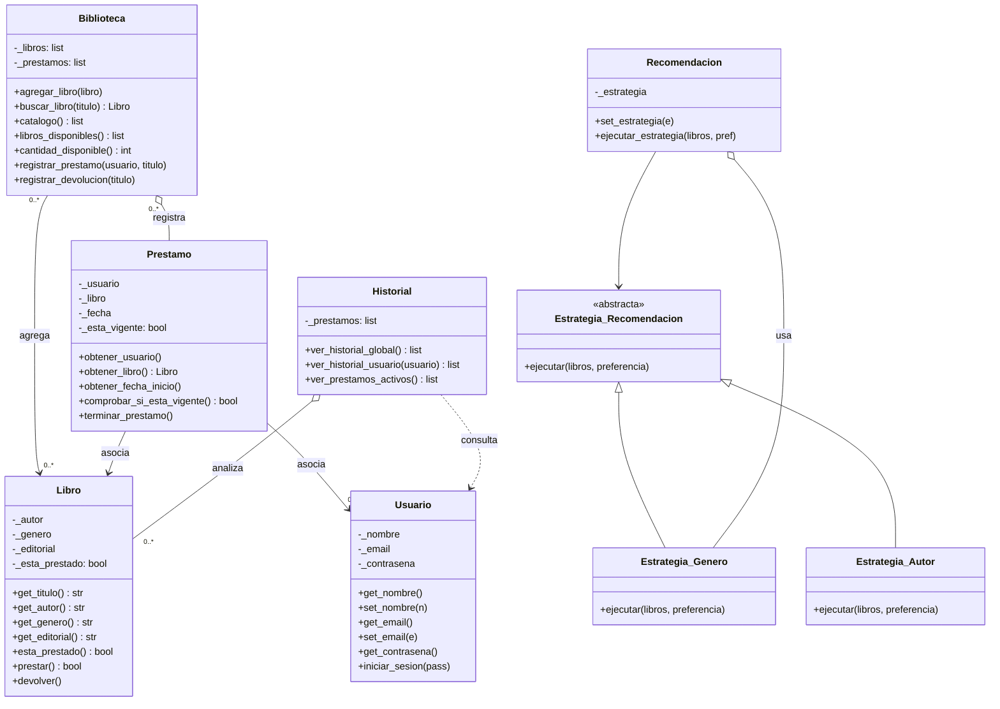

# Sistema de Gestión de Biblioteca

## Integrantes

- Pereyra Joaquín Gabriel.
- Mateo Joaquín Rivero Correa.
- Jorge Ordoñez.
- Aldana Gonzalez.

## Descripción

Este repositorio contiene un **Sistema de Gestión de Biblioteca**, en el cual se pueden gestionar usuarios, libros y préstamos. Su función principal es la **recomendación de libros**: según el contenido que lea cada usuario, se le dan posibles sugerencias.

El proyecto fue desarrollado en **Python** aplicando el paradigma de **Programación Orientada a Objetos**, para controlar mejor cada clase y aprovechar la facilidad de codificar con este lenguaje.

---

## Requisitos

- **Python 3.10 o superior**
- Las siguientes librerías:
  - `werkzeug` — para el hasheo seguro de contraseñas (necesaria siempre).
  - `customtkinter` — solo si vas a usar la interfaz gráfica.

---

## Instalación

**1. Clonar el repositorio:**

```bash
git clone https://github.com/aljuliedot/Gestion-de-Biblioteca-UNAB.git
cd Gestion-de-Biblioteca-UNAB
```

**2. Instalar las librerías necesarias:**

```bash
pip install werkzeug customtkinter
```

> Si `pip` no se reconoce, probá con `python -m pip install werkzeug customtkinter`.
> Si tu entorno está "externally managed", agregá `--break-system-packages` al final.

---

## Cómo ejecutar

El programa se puede usar de **dos formas**. Las dos usan las mismas clases; cambia solo la interfaz.

### Opción 1 — Aplicación de consola (menú)

```bash
python main.py
```

Se abre un menú interactivo con las siguientes opciones:

```
1. Agregar libro
2. Ver catalogo completo
3. Buscar libro
4. Ver libros disponibles
5. Prestar libro
6. Devolver libro
7. Ver historial global
8. Ver prestamos activos
0. Salir
```

Se elige una opción escribiendo su número y presionando Enter.

### Opción 2 — Interfaz gráfica de escritorio

```bash
python interfaz.py
```

Se abre una ventana con un panel lateral (Catálogo, Agregar libro, Recomendar, Historial). Permite prestar y devolver libros con botones, agregar libros desde un formulario y pedir recomendaciones por autor o género.

> La interfaz requiere `customtkinter` instalado. Si solo querés la versión de consola, no hace falta.

---

## Estructura del proyecto

| Archivo | Descripción |
|---|---|
| `sistema.py` | Todas las clases del sistema (Biblioteca, Libro, Usuario, Prestamo, Historial, estrategias de recomendación). |
| `main.py` | Aplicación de consola: el menú interactivo. Usa las clases de `sistema.py`. |
| `interfaz.py` | Interfaz gráfica de escritorio (CustomTkinter). Usa las clases de `sistema.py`. |
| `README.md` | Este archivo. |

---

## Notas

- Si en Windows el comando `python` abre la Microsoft Store, usá `py main.py` o la ruta completa de tu intérprete de Python.
- La interfaz gráfica es un agregado opcional: la aplicación de consola es totalmente funcional por sí sola.

## Diagrama de Clases

